# VideoGrain: Modulating Space-Time Attention for Multi-Grained Video Editing (ICLR 2025)
## [<a href="https://knightyxp.github.io/VideoGrain_project_page/" target="_blank">Project Page</a>]

[](https://arxiv.org/abs/2502.17258)
[](https://huggingface.co/papers/2502.17258)
[](https://knightyxp.github.io/VideoGrain_project_page/)
[](https://drive.google.com/file/d/1dzdvLnXWeMFR3CE2Ew0Bs06vyFSvnGXA/view?usp=drive_link)

[](https://www.youtube.com/watch?v=XEM4Pex7F9E)


## Introduction
VideoGrain is a zero-shot method for class-level, instance-level, and part-level video editing.
- **Multi-grained Video Editing**
  - class-level: Editing objects within the same class (previous SOTA limited to this level)
  - instance-level: Editing each individual instance to distinct object
  - part-level: Adding new objects or modifying existing attributes at the part-level
- **Training-Free** 
  - Does not require any training/fine-tuning
- **One-Prompt Multi-region Control & Deep investigations about cross/self attn** 
  - modulating cross-attn for multi-regions control (visualizations available)
  - modulating self-attn for feature decoupling (clustering are available)

<table class="center" border="1" cellspacing="0" cellpadding="5">
  <tr>
    <td colspan="2" style="text-align:center;"></td>
    <td colspan="2" style="text-align:center;"></td>
    <td colspan="2" style="text-align:center;"></td>
  </tr>
  <tr>
    <!-- <td colspan="1" style="text-align:right; width:125px;"> &nbsp;&nbsp;&nbsp;&nbsp;&nbsp;&nbsp;&nbsp;&nbsp;&nbsp;&nbsp;&nbsp;&nbsp;&nbsp;&nbsp;&nbsp;&nbsp;&nbsp;&nbsp;</td> -->
    <td colspan="2" style="text-align:right; width:250px;"> class level</td>
    <td colspan="1" style="text-align:center; width:125px;">instance level</td>
    <td colspan="1" style="text-align:center; width:125px;">part level</td>
    <td colspan="2" style="text-align:center; width:250px;">animal instances</td>
  </tr>
  
  <tr>
    <td colspan="2" style="text-align:center;"></td>
    <td colspan="2" style="text-align:center;"></td>
    <td colspan="2" style="text-align:center;"></td>
  </tr>
  <tr>
    <td colspan="2" style="text-align:center; width:250px;">animal instances</td>
    <td colspan="2" style="text-align:center; width:250px;">human instances</td>
    <td colspan="2" style="text-align:center; width:250px;">part-level modification</td>
  </tr>
</table>

## 📀 Demo Video
<!-- [](https://www.youtube.com/watch?v=XEM4Pex7F9E "Demo Video of VideoGrain") -->
https://github.com/user-attachments/assets/9bec92fc-21bd-4459-86fa-62404d8762bf


## 📣 News
* **[2025/2/25]**  Our VideoGrain is posted and recommended  by Gradio on [LinkedIn](https://www.linkedin.com/posts/gradio_just-dropped-videograin-a-new-zero-shot-activity-7300094635094261760-hoiE) and [Twitter](https://x.com/Gradio/status/1894328911154028566), and recommended by [AK](https://x.com/_akhaliq/status/1894254599223017622).
* **[2025/2/25]**  Our VideoGrain is submited by AK to [HuggingFace-daily papers](https://huggingface.co/papers?date=2025-02-25), and rank [#1](https://huggingface.co/papers/2502.17258) paper of that day.
* **[2025/2/24]**  We release our paper on [arxiv](https://arxiv.org/abs/2502.17258), we also release [code](https://github.com/knightyxp/VideoGrain) and [full-data](https://drive.google.com/file/d/1dzdvLnXWeMFR3CE2Ew0Bs06vyFSvnGXA/view?usp=drive_link) on google drive.
* **[2025/1/23]**  Our paper is accepted to [ICLR2025](https://openreview.net/forum?id=SSslAtcPB6)! Welcome to **watch** 👀 this repository for the latest updates.


## 🍻 Setup Environment
Our method is tested using cuda12.1, fp16 of accelerator and xformers on a single L40.

```bash
# Step 1: Create and activate Conda environment
conda create -n videograin python==3.10 
conda activate videograin

# Step 2: Install PyTorch, CUDA and Xformers
conda install pytorch==2.3.1 torchvision==0.18.1 torchaudio==2.3.1 pytorch-cuda=12.1 -c pytorch -c nvidia
pip install --pre -U xformers==0.0.27
# Step 3: Install additional dependencies with pip
pip install -r requirements.txt
```

`xformers` is recommended to save memory and running time. 

</details>

You may download all the base model checkpoints using the following bash command
```bash
## download sd 1.5, controlnet depth/pose v10/v11
bash download_all.sh
```

<details><summary>Click for ControlNet annotator weights (if you can not access to huggingface)</summary>

You can download all the annotator checkpoints (such as DW-Pose, depth_zoe, depth_midas, and OpenPose, cost around 4G) from [baidu](https://pan.baidu.com/s/1sgBFLFkdTCDTn4oqHjGb9A?pwd=pdm5) or [google](https://drive.google.com/file/d/1qOsmWshnFMMr8x1HteaTViTSQLh_4rle/view?usp=drive_link)
Then extract them into ./annotator/ckpts

</details>

## ⚡️ Prepare all the data

### Full VideoGrain Data
We have provided `all the video data and layout masks in VideoGrain` at following link. Please download unzip the data and put them in the `./data' root directory.
```
gdown https://drive.google.com/file/d/1dzdvLnXWeMFR3CE2Ew0Bs06vyFSvnGXA/view?usp=drive_link
tar -zxvf videograin_data.tar.gz
```
### Customize Your Own Data 
**prepare video to frames**
If the input video is mp4 file, using the following command to process it to frames:
```bash
python image_util/sample_video2frames.py --video_path 'your video path' --output_dir './data/video_name/video_name'
```
**prepare layout masks**
We segment videos using our ReLER lab's [SAM-Track](https://github.com/z-x-yang/Segment-and-Track-Anything). I suggest using the `app.py` in SAM-Track for `graio` mode to manually select which region in the video your want to edit. Here, we also provided an script ` image_util/process_webui_mask.py` to process masks from SAM-Track path to VideoGrain path.


## 🔥🔥🔥 VideoGrain Editing

### 🎨 Inference
Your can reproduce the instance + part level results in our teaser by running:

```bash
bash test.sh 
#or 
CUDA_VISIBLE_DEVICES=0 accelerate launch test.py --config config/part_level/adding_new_object/run_two_man/spider_polar_sunglass.yaml
```

For other instance/part/class results in VideoGrain project page or teaser, we provide all the data (video frames and layout masks) and corresponding configs to reproduce, check results in [🚀Multi-Grained Video Editing](#multi-grained-video-editing-results).

<details><summary>The result is saved at `./result` . (Click for directory structure) </summary>

```
result
├── run_two_man
│   ├── control                         # control conditon 
│   ├── infer_samples
│           ├── input                   # the input video frames
│           ├── masked_video.mp4        # check whether edit regions are accuratedly covered
│   ├── sample
│           ├── step_0                  # result image folder
│           ├── step_0.mp4              # result video
│           ├── source_video.mp4        # the input video
│           ├── visualization_denoise   # cross attention weight
│           ├── sd_study                # cluster inversion feature
```
</details>


## Editing guidance for YOUR Video
### 🔛prepare your config

VideoGrain is a training-free framework. To run VideoGrain on your video, modify `./config/demo_config.yaml` based on your needs:

1. Replace your pretrained model path and controlnet path in your config. you can change the control_type to `dwpose` or `depth_zoe` or `depth`(midas).
2. Prepare your video frames and layout masks (edit regions) using SAM-Track or SAM2 in dataset config.
3. Change the `prompt`, and extract each `local prompt` in the editing prompts. the local prompt order should be same as layout masks order.
4. Your can change flatten resolution with 1->64, 2->16, 4->8. (commonly, flatten at 64 worked best)
5. To ensure temporal consistency, you can set `use_pnp: True` and `inject_step:5/10`. (Note: pnp>10 steps will be bad for multi-regions editing)
6. If you want to visualize the cross attn weight, set `vis_cross_attn: True`
7. If you want to cluster DDIM Inversion spatial temporal video feature, set `cluster_inversion_feature: True`

### 😍Editing your video

```bash
bash test.sh 
#or 
CUDA_VISIBLE_DEVICES=0 accelerate launch test.py --config  /path/to/the/config
```

## 🚀Multi-Grained Video Editing Results

### 🌈 Multi-Grained Definition 
You can get multi-grained definition result, using the following command:
```bash
CUDA_VISIBLE_DEVICES=0 accelerate launch test.py --config /config/class_level/running_two_man/man2spider.yaml   #class-level
                                                # /config/instance_level/running_two_man/4cls_spider_polar.yaml  #instance-level
                                      #config/part_level/adding_new_object/run_two_man/spider_polar_sunglass.yaml #part-level
```
<table class="center">
<tr>
  <td width=25% style="text-align:center;">source video</td>
  <td width=25% style="text-align:center;">class level</td>
  <td width=25% style="text-align:center;">instance level</td>
  <td width=25% style="text-align:center;">part level</td>
</tr>
<tr>
  <td>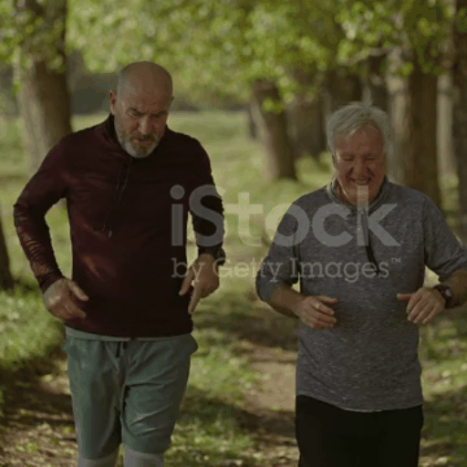</td>
  <td></td>
  <td></td>
  <td></td>
</tr>
</table>

## 💃 Instance-level Video Editing
You can get instance-level video editing results, using the following command:
```bash
CUDA_VISIBLE_DEVICES=0 accelerate launch test.py --config  config/instance_level/running_two_man/running_3cls_iron_spider.yaml
```

<table class="center">
<tr>
  <td width=50% style="text-align:center;">running_two_man/3cls_iron_spider.yaml</td>
  <td width=50% style="text-align:center;">2_monkeys/2cls_teddy_bear_koala.yaml</td>
</tr>
<tr>
  <td></td>
  <td></td>
</tr>
<tr>
  <td width=50% style="text-align:center;">badminton/2cls_wonder_woman_spiderman.yaml</td>
  <td width=50% style="text-align:center;">soap-box/soap-box.yaml</td>
</tr>
<tr>
  <td></td>
  <td></td>
</tr>
<tr>
  <td width=50% style="text-align:center;">2_cats/4cls_panda_vs_poddle.yaml</td>
  <td width=50% style="text-align:center;">2_cars/left_firetruck_right_bus.yaml</td>
</tr>
<tr>
  <td></td>
  <td></td>
</tr>
</table>

## 🕺 Part-level Video Editing
You can get part-level video editing results, using the following command:
```bash
CUDA_VISIBLE_DEVICES=0 accelerate launch test.py --config config/part_level/modification/man_text_message/blue_shirt.yaml
```

<table class="center">
<tr>
  <td></td>
  <td></td>
  <td></td>
  <td>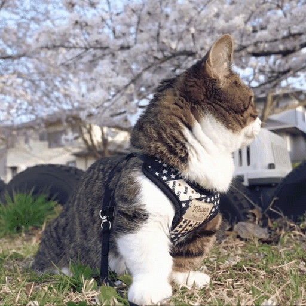</td>
  <td></td>
  <td>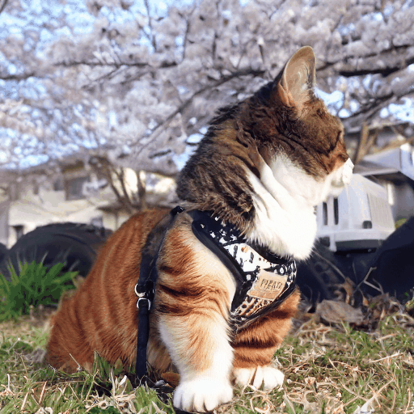</td>
</tr>
<tr>
  <td width=15% style="text-align:center;">source video</td>
  <td width=15% style="text-align:center;">blue shirt</td>
  <td width=15% style="text-align:center;">black suit</td>
  <td width=15% style="text-align:center;">source video</td>
  <td width=15% style="text-align:center;">ginger head </td>
  <td width=15% style="text-align:center;">ginger body</td>
</tr>
<tr>
  <td></td>
  <td></td>
  <td></td>
  <td>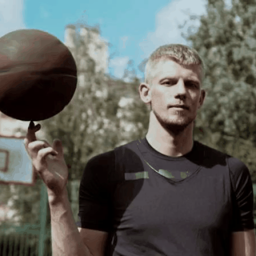</td>
  <td></td>
  <td>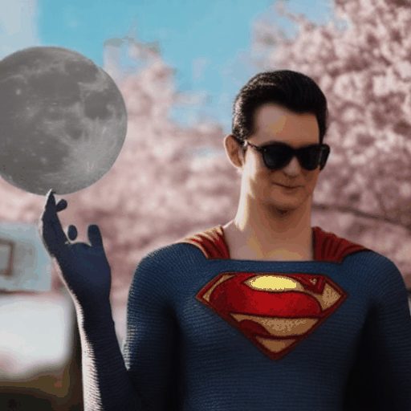</td>
</tr>
<tr>
  <td width=15% style="text-align:center;">source video</td>
  <td width=15% style="text-align:center;">superman</td>
  <td width=15% style="text-align:center;">superman + cap</td>
  <td width=15% style="text-align:center;">source video</td>
  <td width=15% style="text-align:center;">superman </td>
  <td width=15% style="text-align:center;">superman + sunglasses</td>
</tr>
</table> 

## 🥳 Class-level Video Editing
You can get class-level video editing results, using the following command:
```bash
CUDA_VISIBLE_DEVICES=0 accelerate launch test.py --config config/class_level/wolf/wolf.yaml
```

<table class="center">
<tr>
  <td>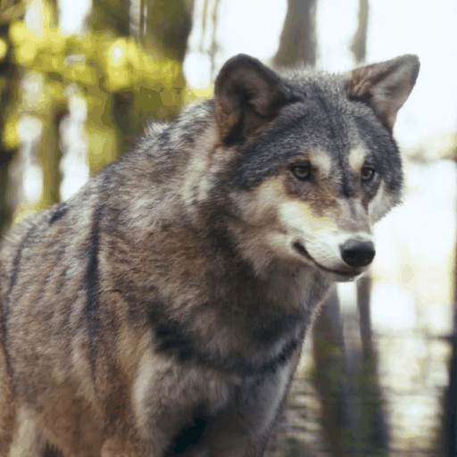</td>
  <td>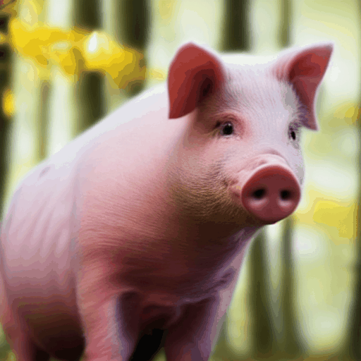</td>
  <td></td>
  <td></td>
  <td></td>
</tr>
<tr>
  <td width=15% style="text-align:center;">input</td>
  <td width=15% style="text-align:center;">pig</td>
  <td width=15% style="text-align:center;">husky</td>
  <td width=15% style="text-align:center;">bear</td>
  <td width=15% style="text-align:center;">tiger</td>
</tr>
<tr>
  <td></td>
  <td>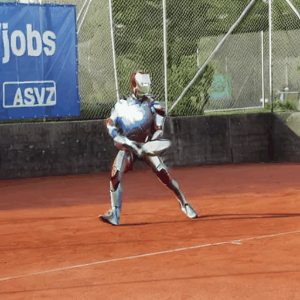</td>
  <td>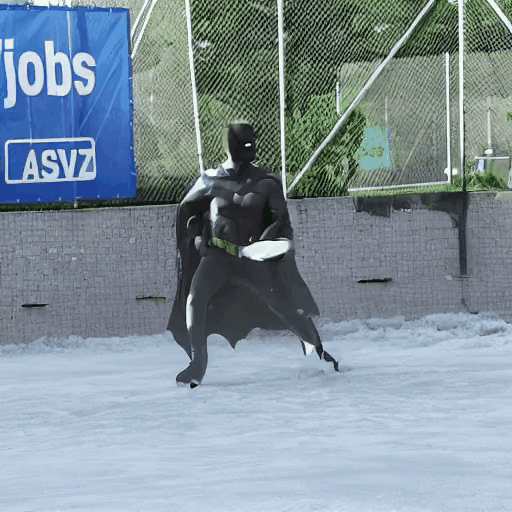</td>
  <td></td>
  <td>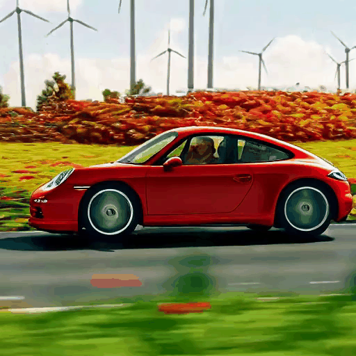</td>
</tr>
<tr>
  <td width=15% style="text-align:center;">input</td>
  <td width=15% style="text-align:center;">iron man</td>
  <td width=15% style="text-align:center;">Batman + snow court + iced wall</td>
  <td width=15% style="text-align:center;">input </td>
  <td width=15% style="text-align:center;">posche</td>
</tr>
</table>


##  Soely Edit on specific subjects, keep background unchanged
You can get soely video editing results, using the following command:
```bash
CUDA_VISIBLE_DEVICES=0 accelerate launch test.py --config config/instance_level/soely_edit/only_left.yaml
                                                #--config config/instance_level/soely_edit/only_right.yaml
                                                #--config config/instance_level/soely_edit/joint_edit.yaml
```

<table class="center">
<tr>
  <td></td>
  <td>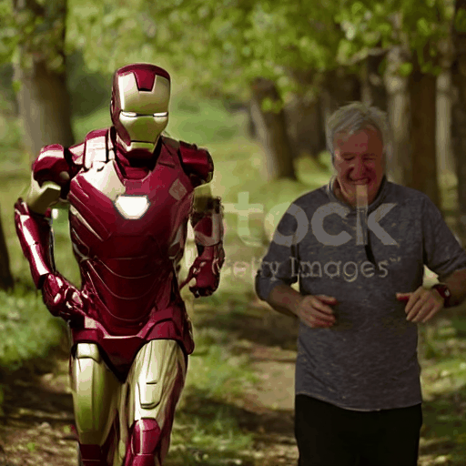</td>
  <td>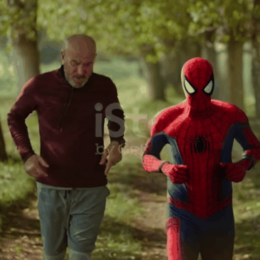</td>
  <td>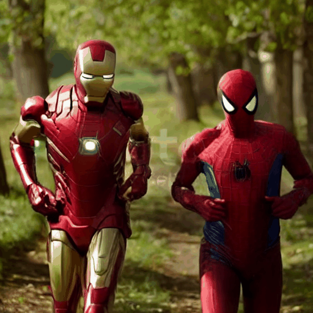</td>
</tr>
<tr>
  <td width=25% style="text-align:center;">source video</td>
  <td width=25% style="text-align:center;">left→Iron Man</td>
  <td width=25% style="text-align:center;">right→Spiderman</td>
  <td width=25% style="text-align:center;">joint edit</td>
</tr>
</table>

## 🔍 Visualize Cross Attention Weight
You can get visulize attention weight editing results, using the following command:
```bash
#setting vis_cross_attn: True in your config 
CUDA_VISIBLE_DEVICES=0 accelerate launch test.py --config config/instance_level/running_two_man/3cls_spider_polar_vis_weight.yaml
```

<table class="center">
<tr>
  <td></td>
  <td></td>
  <td>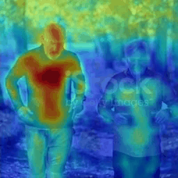</td>
  <td>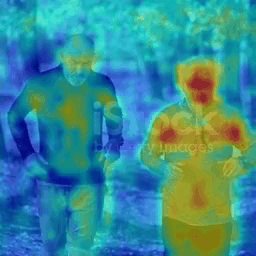</td>
  <td></td>
</tr>
<tr>
  <td width=20% style="text-align:center;">source video</td>
  <td width=20% style="text-align:center;">left→spiderman, right→polar bear, trees→cherry blossoms</td>
  <td width=20% style="text-align:center;">spiderman weight</td>
  <td width=20% style="text-align:center;">bear weight</td>
  <td width=20% style="text-align:center;">cherry weight</td>
</tr>
</table>

## ✏️ Citation 
If you think this project is helpful, please feel free to leave a star⭐️⭐️⭐️ and cite our paper:
```bibtex
@article{yang2025videograin,
  title={VideoGrain: Modulating Space-Time Attention for Multi-grained Video Editing},
  author={Yang, Xiangpeng and Zhu, Linchao and Fan, Hehe and Yang, Yi},
  journal={arXiv preprint arXiv:2502.17258},
  year={2025}
}
``` 

## 📞 Contact Authors
Xiangpeng Yang [@knightyxp](https://github.com/knightyxp), email: knightyxp@gmail.com/Xiangpeng.Yang@student.uts.edu.au

## ✨ Acknowledgements

- This code builds on [diffusers](https://github.com/huggingface/diffusers), and [FateZero](https://github.com/ChenyangQiQi/FateZero). Thanks for open-sourcing!
- We would like to thank [AK(@_akhaliq)](https://x.com/_akhaliq/status/1894254599223017622) and Gradio team for recommendation!


## ⭐️ Star History

[](https://star-history.com/#knightyxp/VideoGrain&Date)
